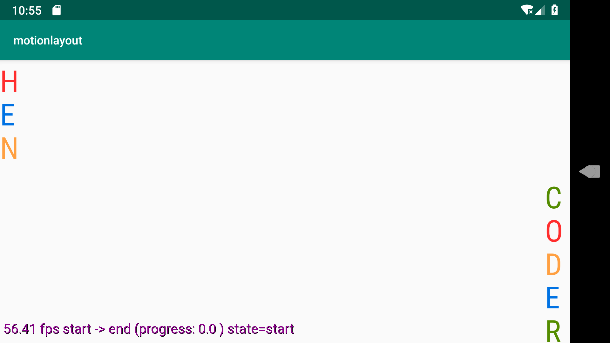
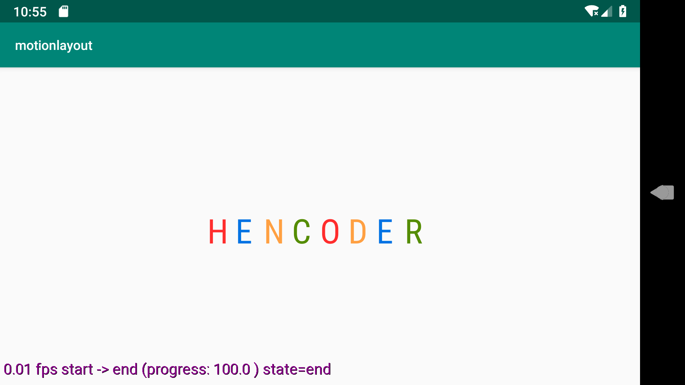
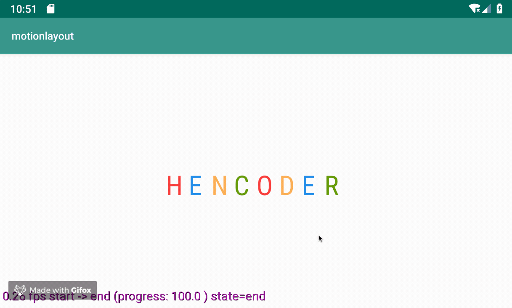

# MotionLayout 构建过渡

本篇会介绍如何使用 `MotionLayout` 快速创建一个简单的过渡效果。


## 构建过渡只需要三步

在开始之前请牢记，构建过渡，只需简单的三步。

1. 创建起始场景 (StartScene)
2. 创建结束场景 (EndScene)
3. 调整起始场景到结束场景的方式

废话不多说直接开始


### 构建开始场景

首先，我们有一个起始场景



```xml
<ConstraintSet android:id="@+id/start">
        <Constraint android:layout_width="wrap_content"
                    android:id="@id/guide"
                    android:orientation="horizontal"
                    motion:layout_constraintGuide_percent="0.5"
                    android:layout_height="wrap_content"/>

        <Constraint android:id="@id/h"
                    android:layout_width="30dp"
                    android:layout_height="40dp"
                    motion:layout_constraintTop_toTopOf="parent"
                    motion:layout_constraintStart_toStartOf="parent"/>

         <!--E ... R 代码略-->

    </ConstraintSet>

```


### 构建结束场景

然后，我们有一个结束场景



```xml
    <ConstraintSet android:id="@id/end">
        <Constraint android:layout_width="wrap_content"
                    android:id="@id/guide"
                    android:orientation="horizontal"
                    motion:layout_constraintGuide_percent="0.5"
                    android:layout_height="wrap_content"/>

        <Constraint android:layout_width="30dp"
                    android:layout_height="40dp"
                    motion:layout_constraintHorizontal_chainStyle="packed"
                    motion:layout_constraintTop_toTopOf="@id/guide"
                    motion:layout_constraintBottom_toBottomOf="@id/guide"
                    motion:layout_constraintEnd_toStartOf="@id/e1"
                    android:id="@id/h"
                    motion:layout_constraintStart_toStartOf="parent"/>

          <!--E ... R 代码略-->
    </ConstraintSet>
```


### 构建过渡

最后，我们得到了整个过渡过程


```xml

    <Transition motion:constraintSetStart="@+id/start"
                motion:constraintSetEnd="@+id/end"
                motion:duration="1200">

        <!-- H 滑动修改过渡状态-->
        <OnSwipe motion:dragDirection="dragRight"
                 motion:touchAnchorSide="right"
                 motion:touchAnchorId="@id/h"/>

        <KeyFrameSet>
            <!-- 位置关键帧 使用 path 坐标系 -->
            <KeyPosition motion:target="@id/h"
                         motion:framePosition="85"
                         motion:percentX="0.8"
                         motion:percentY="-0.15"
                         motion:keyPositionType="pathRelative"/>

            <KeyPosition motion:target="@id/e1"
                         motion:framePosition="85"
                         motion:percentX="0.9"
                         motion:percentY="0.25"
                         motion:keyPositionType="pathRelative"/>

            <KeyPosition motion:target="@id/n"
                         motion:framePosition="40"
                         motion:percentX="0.7"
                         motion:percentY="-0.25"
                         motion:keyPositionType="pathRelative"/>

            <!--对 C 同时设置两个关键帧-->
            <KeyPosition motion:target="@id/c"
                         motion:framePosition="85"
                         motion:percentX="0.95"
                         motion:percentY="0.25"
                         motion:keyPositionType="pathRelative"/>

            <KeyPosition motion:target="@id/c"
                         motion:framePosition="35"
                         motion:percentX="0.35"
                         motion:percentY="-0.05"
                         motion:keyPositionType="pathRelative"/>

            <KeyPosition motion:target="@id/o"
                         motion:framePosition="35"
                         motion:percentX="0.05"
                         motion:percentY="0.2"
                         motion:keyPositionType="pathRelative"/>

            <KeyPosition motion:target="@id/o"
                         motion:framePosition="85"
                         motion:percentX="0.85"
                         motion:percentY="0.2"
                         motion:keyPositionType="pathRelative"/>

            <KeyPosition motion:target="@id/d"
                         motion:framePosition="15"
                         motion:transitionEasing="accelerate"
                         motion:keyPositionType="deltaRelative"
                         motion:percentY="0.15"/>


            <KeyPosition motion:target="@id/d"
                         motion:framePosition="85"
                         motion:transitionEasing="decelerate"
                         motion:percentX="1.1"
                         motion:percentY="-0.45"
                         motion:keyPositionType="pathRelative"/>


            <!-- 在 90% 的时候到达终点-->
            <KeyPosition motion:target="@id/e2"
                         motion:framePosition="90"
                         motion:percentX="1"
                         motion:percentY="0"
                         motion:keyPositionType="pathRelative"/>


            <!-- 差值坐标系 -->
            <KeyPosition motion:target="@id/e2"
                         motion:framePosition="95"
                         motion:percentX="1"
                         motion:percentY="1.2"
                         motion:keyPositionType="deltaRelative"/>


        </KeyFrameSet>
    </Transition>
```

当然你也可以对目标加点事件来启动过渡

```xml
<Transition motion:constraintSetStart="@+id/start"
            motion:constraintSetEnd="@+id/end"
            motion:duration="1200">
     
        <!-- R 切换起始/结束状态-->
        <OnClick motion:clickAction="toggle"
                 motion:target="@id/r"/>

        <!--左侧 E 过渡到起始状态-->
        <OnClick motion:clickAction="transitionToStart"
                 motion:target="@id/e1"/>

        <!--右侧 E 过渡到结束状态-->
        <OnClick motion:clickAction="transitionToEnd"
                 motion:target="@id/e2"/>
     
     
     <KeyFrameSet>
         <!-- 略 -->
     </KeyFrameSet>
</Transition>
```


[去 github 查看具体代码](https://github.com/pdog18/android-transitions-tutorial/tree/master/sample-motionlayout)